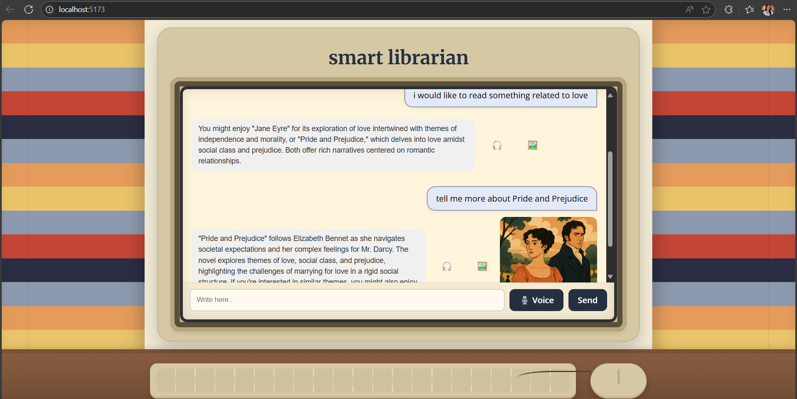

# Smart Librarian - AI with RAG + Tool Completion

## Overview

This project is an AI-powered chatbot that recommends books based on user interests using OpenAI, RAG (with ChromaDB), and a tool for detailed book summaries. The project integrates both a Python backend (with FastAPI) and a React frontend.

## Project Structure

- **Frontend**
  - `frontend/src/App.jsx` – Main application component.
  - `frontend/src/components/` – Contains UI components such as InputBox, ChatWindow, BotMessage, and Message.
  - `frontend/src/services/api.js` – Centralizes API calls using Axios.

- **Backend**
  - `backend/main.py` – FastAPI application entry point.
  - `backend/routes/chat_routes.py` – Exposes the `/chat` endpoint.
  - `backend/services/` – Houses service modules for embeddings, GPT recommendations, and tool integration.
  - `backend/utils/badwords.py` – Utility for filtering inappropriate language.
  - `book_summaries` – Contains a file or resource with 10+ book summaries.

## Requirements

- **Languages/Tools:** Python, JavaScript, React
- **Package Managers:** pip, npm
- **Key Dependencies:**
  - Python packages: FastAPI, Pydantic, Uvicorn, OpenAI SDK
  - JavaScript packages: Axios, React, and related libraries

## Features

1. **Book Summaries Database**
   - A file or resource (`book_summaries`) contains detailed summaries for 10+ books.
2. **Semantic Search and Retrieval**
   - Uses OpenAI embeddings (e.g., `text-embedding-3-small`) with a vector store like ChromaDB.
3. **Chatbot Interface**
   - A conversational UI that accepts specific queries, retrieves recommendations, and displays both a brief recommendation and a detailed summary using a tool (`get_summary_by_title`).
4. **Language Filtering**
   - Filters out inappropriate content before processing the query.
5. **Audio Support (Optional)**
   - Features for text-to-speech and speech-to-text for a richer user experience.
6. **Image Generation (Optional)**
   - Generates representative images (e.g., book covers) based on the recommendation.
   
## Setup and Installation

1. **Clone the Repository**

   ```bash
   git clone https://github.com/anca291/SmartLibrarian.git
   cd SmartLibrarian
    ```

2. **Backend Setup**

    Create a virtual environment and activate it:
    ``` bash
      python -m venv venv
      venv\Scripts\activate
      pip install -r backend/requirements.txt
    ```
    Run the backend server:
    ``` bash
    uvicorn backend.main:app --reload
    ```
   
    Create an .env file in the backend folder and set your OpenAI API key.
    Example .env: OPENAI_API_KEY=your_api_key_here

3. **Frontend Setup**

    Ensure you have Node.js and npm installed. Then, follow these steps:
    ``` bash
    cd frontend
   npm install
   npm run dev
   ```

## Usage
Interact with the chatbot interface to ask for book recommendations like:
"I want a book about friendship and magic."
"What do you recommend for someone who loves war stories?"
"Tell me about 1984."
The chatbot will search the vector store for semantically similar book summaries, provide a brief recommendation, then call the tool get_summary_by_title to display the full summary.

